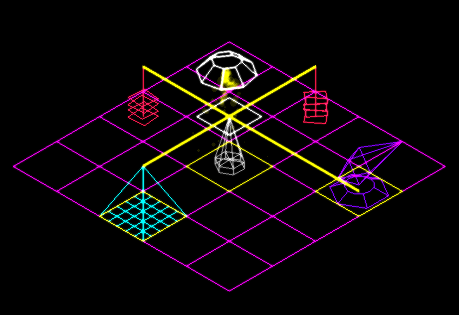

# Grid Surge

This game was created for the Spring 2025 pygame jam. 

## Plot

You invent an engine that seemingly produces energy out of empty space, and a device that warps space into more space. So infinite free energy, right? Unfortunately, bending the laws of reality attracts attention from eldritch entities, determined to destroy your engines. Fight back using reality-bending cannons, and claim as much of the energy as you dare!



## Installation:

Execute the following commands:

```
git clone https://github.com/MathewKJ2048/pygame-jam-spring-2025
cd ./pygame-jam-spring-2025
make setup
make run
```

Requirements:
- `git`
- `python >= 3.11`
- `pip`

All python packages needed for the game are installed in a virtual environment, and can be removed with `make clean`. To build an executable for your OS, run `make build`. The executable appears in `./dist`.

Alternatively, get the linux executable at [https://mkj2048.itch.io/grid-surge](https://mkj2048.itch.io/grid-surge)

## Controls:

- Arrow keys to move
- `e` - engine (produces energy)
- `t` - tower (transmits energy via connections)
- `w` - warper (warps space when provided a constant power supply)
- `h` - high tower (transmits energy over longer distances, but fewer connections)
- `c` - cannon (shoots bugs, consumes power when shooting)
- `b` - battery (stores power)

- `q` - deconstruct selected element

- `,` and `.` - rotate camera
- `m` - toggle minimap
- `z` - toggle music
- `x` - toggle SFX
- `p` - toggle pause

### Dev mode
- `v` - summon a bug
- `s` - subdivide space

Controls can be configured by changing `./src/controls.py`

## Tips:

- The selected square is outlined in white. Construction or destruction affects the elemnt placed in that square.
- The size of the yellow box under the element determines the amount of energy stored by the element.
- Bugs come in three forms - quick, normal and armored.
- Cannons shoot any bug within range and at the same spatial scale as them. They do not target bugs in space warped relative to their space, so place cannons at all scales for an effective defense.
- Cannons draw a lot of power when firing. Place batteries to provide reserve stores for the cannons to draw on in case the engines get destroyed.
- If a warper loses power, all the elements within it are destroyed. This results in a rapid decay in power output if you rely on engines inside a warper for your power. Keep an eye on your power generation.
- Controls can be edited 

## Screenshots:


## Acknowledgments:

- [LMMS](https://lmms.io/) and [SFXR](https://www.drpetter.se/project_sfxr.html), for music and SFX
- [DaFluffyPotato](https://dafluffypotato.itch.io/) for their [excellent explanation](https://www.youtube.com/watch?v=LFbePt8i0DI) of incorporating shaders in pygame
- 
